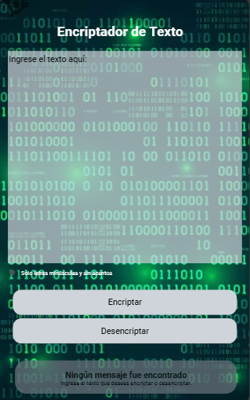

<h1>Encriptador de Texto</h1>

**Encriptador de Texto** es una aplicación web y version móvil/tablet, que permite a los usuarios encriptar y desencriptar texto utilizando técnicas simples de sustitución de caracteres, utilizando Javascript, html y css.


<h2>Estado del proyecto:</h2>
-Finalizado, con posibles mejoras más adelante.

<h2>Descripción del Proyecto y sus funcionalidades</h2>

Este proyecto está organizado inicialmente por el siguiente logo en el header 

Un titulo de Encriptador de Texto, dos columnas para la vista **desktop**, para la version **móvil** y **tablet** muestra toda la información en una sola columna.

### Columna 1

- **Campo de Texto:** Campo tipo texto Input - Aquí el usuario puede ingresar el texto que desea encriptar o desencriptar.


    <h3>Validaciones del campo de texto</h3>
    -Solo permite letras minúsculas, sin caracteres espaciales y sin asentos, adicional es obligatorio diligenciar el campo de texto,         estas validaciones las realiza el sistema al dar clic en encriptar.
    
    -Mensajes de alerta que muestra el sistema al diligenciar incorrectamente el texto y dar clic en encriptar:

        Por favor ingrese un texto para encriptar
    
        Por favor no incluya letras mayúsculas, acentos, ni caracteres especiales
  

- **Botón de Encriptar:** Al dar clic en encriptar, el sistema transforma el texto ingresado en su versión encriptada, teniendo en cuenta las validaciones anteriormente mencionadas.
  
- **Botón de Desencriptar:** Al dar clic en desencriptar, el sistema convierte el texto encriptado de vuelta a su forma original, si el texto no ha sido encriptado inicialmente, el sistema muestra mensaje de alerta:
  
        -El texto ingresado no ha sido encriptado inicialmente
  
si no se diligencia ningun texto en el campo al dar clic en encriptar, el sistema muestra el siguiente mensaje de alerta:

        -Por favor ingrese un texto para desencriptar


### Columna 2

- **Mensaje Inicial tipo texto:** Muestra el siguiente mensaje:
  
      "Ningún mensaje fue encontrado
      Ingresa el texto que desees encriptar o desencriptar."
  
tambien muestra la siguiente imagen:


(la imagen no estará disponible para **móvil** y **tablet**).

- **Resultado:** En este espacio de tipo texto, el sistema muestra el texto encriptado o desencriptado como resultado después de haber diligenciado el **Campo de Texto** y haber dado clic en los botones correspondientes a (encriptar o desencriptar).
- 
- **Botón de Copiar:** Permite copiar al portapapeles el texto encriptado o desencriptado, el cual se encuentra en el campo **Resultado**, para posteriormente poderlo pegar en el **campo de texto** de la columna 1.
  

<h2>Cómo Funciona</h2>

1. **Ingreso de Texto:** El usuario escribe el texto en el **Campo de Texto:** de la Columna 1, texto que no puede estar vacio, debe tener solo letras minusculas, sin acentos y sin caracteres especiales.
2. **Encriptar Texto:** Al hacer clic en el botón de encriptar, el texto se convierte según reglas predefinidas y muestra el resultado en el texto de la columna 2 **resultado**:
   - **e**  en **enter**
   - **i**  en **imes**
   - **a**  en  **ai**
   - **o**  en  **ober**
   - **u**  en **ufat**
3. **Desencriptar Texto:** Al hacer clic en el botón de desencriptar, el texto encriptado se convierte de vuelta a su forma original y muestra el resultado en el texto de la columna 2 **resultado**
4. **Copiar Texto:** Permite copiar al portapapeles el texto de la columna 2 **resultado** ya encriptado o desencriptado, segun el botón seleccionado anteriormente, para usarlo o copiarlo en el **Campo de Texto** de la Columna 1.

Imagenes de la página en su versión Desktop:


Imagenes de la página en su versión Móvil:




<h2> Tecnologías utilizadas:</h2>
-javaScript
-css
-html
-visual studio code
-git
-gitHub

<h2>Personas-Desarrolladores del Proyecto:</h2>
-Paola Betancourth

<h2>Instalación</h2>
**Clona el Repositorio:**

   ```bash
   git clone https://github.com/Paola05BE/demoluis.git
